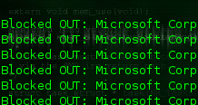

> MoBlock is now deprecated. It's official successor is [PeerGuardian Linux (pgl)](https://help.ubuntu.com/community/PeerGuardian). It is highly recommended to use pgl instead of MoBlock. You can found out more on [the official wiki](https://sourceforge.net/p/peerguardian/wiki/pgl-Main/) of the peerguardian project.

With all the recent activity in Ireland with the MPAA you can't be too safe anymore, you no longer know if someone from the MPAA is lurking in your computer watching everything you download and just waiting for the perfect time to send you that court summons.

Program's can be installed to prevent people like this getting access to your computer, on Windows you have PeerGuardian, for Linux you have MoBlock. We can't really tell how effective these peer blocking tools are but in this day and age it's better to have some security rather than no security!

I'm going to just focus a little more on the power of MoBlock though, which is rumoured to soon be the official PeerGuardian for windows.

Installation is a breeze if your using Ubuntu Jaunty, for other .deb users read here.

First open up a terminal and edit your sources.list you can do this by typing the following:
```bash
sudo kate /etc/apt/sources.list
```
This opens "kate" for you using admin privilages. Add the following to the bottom of the file.
```text
deb http://ppa.launchpad.net/jre-phoenix/ppa/ubuntu jaunty main
deb-src http://ppa.launchpad.net/jre-phoenix/ppa/ubuntu jaunty main
```
You will also have to enable the universe module, this should already be enabled just look for:
```text
deb http://archive.ubuntu.com jaunty main universe
```
Next you'll want to add the gpkg key of the program. To make it trusted, do this by typing the following into a terminal
```bash
gpg --keyserver keyserver.ubuntu.com --recv 9C0042C8
gpg --export --armor 9C0042C8 | sudo apt-key add -
```
Then it's a walk in the park:
```bash
sudo aptitude update
sudo aptitude install moblock blockcontrol mobloquer
```
After it's installed you will be guided through configuring moblock! Good luck! :D