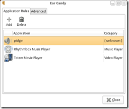
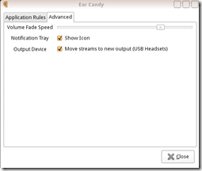

[EarCandy](https://launchpad.net/earcandy) is a volume manager for PulseAudio that fades applications in and out based on your current activity. Meaning it can do handy things like muting your music playing when you decide to turn on a youtube video. [EarCandy](https://launchpad.net/earcandy) can sniff out applications to tell what kind of application they are

### Screenshots:




### How to install Earcandy on Ubuntu Jaunty

You can do this by using the following command:
```bash
sudo kate /etc/apt/sources.list
```
Then add the following to the end of the file:
```text
deb http://ppa.launchpad.net/earcandy-devel/ppa/ubuntu jaunty main
deb-src http://ppa.launchpad.net/earcandy-devel/ppa/ubuntu jaunty main
``
Then you can install earcandy by using the following command!
```bash
sudo apt-get install earcandy
```