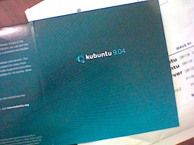

> As of 5th April 2011, ShipIt has ended. [Source](https://ubuntu.com/blog/shipit-comes-to-an-end)

My address has finally been sorted, there was some confusion with the post man and where I lived since moving into the newly built apartment, but today kubuntu 9.04 "Jaunty Jackalope" came through the door!

 > With its world-renowned Ubuntu core and the KDE 4.2 desktop, Kubuntu 9.04 gives users a well-rounded, feature-filled and elegant desktop.

Best of all these cd's are free thanks to Shipit and ubuntu! Check it out [here](https://shipit.kubuntu.org) ! I recommend anyone that has to fix computers to get themselves one, live cd's really can be a lifesaver!