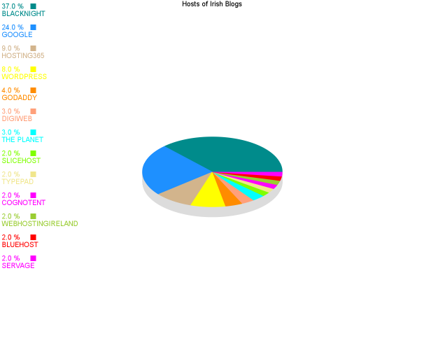

I was interested to see what web hosts are hosting Irish blogs in 2009, so here are the stats.

## Stats
- [BLACKNIGHT](http://www.blacknight.ie) - 46 Irish Blogs Hosted
- [GOOGLE/ BLOGGER](http://www.blogger.com) - 30 Irish Blogs Hosted
- [HOSTING365](http://hosting365.com) - 11 Irish Blogs Hosted
- [WORDPRESS](http://wordpress.com) - 10 Irish Blogs Hosted
- [GODADDY](http://www.godaddy.com) - 5 Irish Blogs Hosted
- [DIGIWEB](http://digiweb.com) - 4 Irish Blogs Hosted
- [TYPEPAD](http://typepad.com) - 3 Irish Blogs Hosted
- [THEPLANET](http://theplanet.com) - 3 Irish Blogs Hosted
- [SLICEHOST](http://www.slicehost.com/) - 3 Irish Blogs Hosted
- [COGNOTENT](http://www.cognotent.com/) - 2 Irish Blogs Hosted
- [WEBHOST IRELAND](http://webhostireland.com/) - 2 Irish Blogs Hosted
- [BLUEHOST](http://bluehost.com) - 2 Irish Blogs Hosted
- [SERVAGE](http://servage.net) - 2 Irish Blogs Hosted

## Pie Chart

