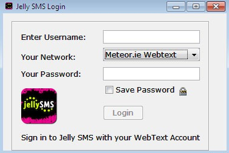

>JellySMS is now abandoned, I've removed any links to it.

One program I’ve been using a while now and is a serious lifesaver for when I'm out of credit is "Jelly SMS" (previously just jSMS). You need to have the latest Java installed for it to work but it is cross-platform. It basically lets you send web texts from your desktop without having to login to your network’s website.

The latest version of the software even supports delivery reports, and support is very good, I’ve noticed it not working maybe twice in the last year (due to o2 redesigning their website), both times the issues where fixed and an automatic update was out within two days.

They also now have an android and iPhone app, for anyone in possession of those luxuries!