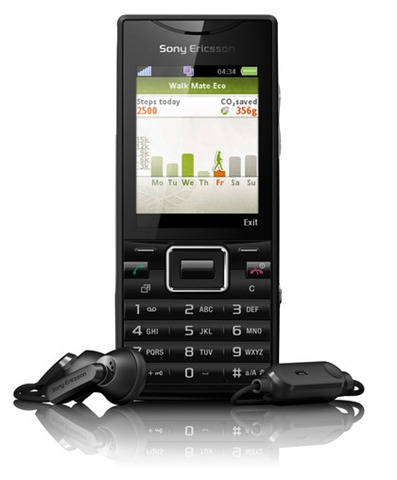
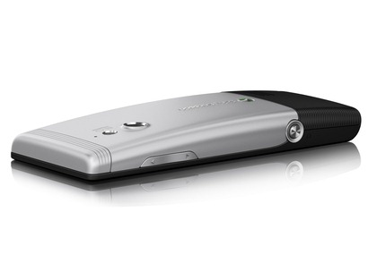

So I’ve finally gotten a new phone, the Sony Ericsson Elm which is a part of Sony Ericsson’s “Greenheart” family. So far I’ve been using the phone a week I am extremely pleased with it. It’s made from recycled plastics and is free from hazardous chemicals – and comes with a low power consumption charger, reduced packaging, some eco-aware apps and an e-manual on the phone instead of a printed guide.

It also comes with built in Wi-Fi and A-GPS technology, HSPA high-speed mobile network data capability, a 5-megapixel camera and a full of multimedia features. Measuring up at 110 x 45 x 14mm at its thickest, and weighing 90g, the Elm feels slim in-hand and pretty lightweight.

The buttons are familiar to Sony Ericsson’s, with a rectangular central navigation D-pad surrounded by more comfortably curved buttons. Although it comes with decent music player software, Sony Ericsson hasn’t built in a standard 3.5mm headphone socket on this model, relying on its Sony Ericsson multi-connector socket on the side. A camera button is included on the side, along with volume keys, while the camera lens on the back panel is accompanied by a small LED flash.

The home screen has a simple widget system, currently allowing a Facebook app, a calendar app and the Sony Ericsson Walk Mate Eco pedometer application. Once selected, these sit on the home screen, and you can switch between them, so you can see regular updates from whichever of the widgets you use.

Email set up and usage is also a now-familiar routine. An email wizard enables you to get started with email by adding just a few details – name, email address, username and password. Settings are downloaded automatically if you’re using popular POP3/IMAP4 email account, and messages from your regular accounts are downloaded to the inbox.

The Elm is powered by a 1000mAh lithium-polymer battery that Sony Ericsson claims can deliver up to 446 hours of standby time or four hours of calls on 3G networks (or 430 hours’ standby or 10 hours’ calls in GSM-only coverage). However if you have WI-FI constantly on like myself you’ll notice the battery last’s about a day and a half. (Not bad considering)

Among the more eye-catching of the other applications pre-loaded onto the Elm are applications that use the onboard A-GPS satellite positioning gadgetry, plus a selection of applications that emphasise the green message behind Sony Ericsson’s “Greenheart” initiative. Google Maps also comes pre-built into the phone and supports street and satellite viewing. Other applications included are Youtube, Accuweather, EcoMate, Neoreader and Wisepilot.

Overall I love this phone, the camera is great and really I’ve just been searching for an affordable phone with WI-FI for quiet a while, this fits that need. The built in browser isn’t amazing but you can fix that by downloading [Opera Mini](https://www.opera.com/mobile) .

Finally the cost I hear you ask? Well I picked it up on o2 pre-pay for €169, I’ve tried to check other provider’s websites for it, Vodafone do not seem to carry the model and the meteor store seems extremely broke at the minute! I’ll update here if that changes!