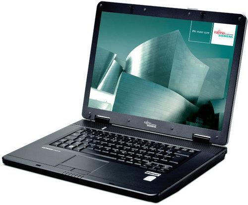

So I ended up picking up a cheap Esprimo Mobile v5535 a few days ago, long story short; laptop broke, Argos have sent it off for repairs that will take 2-3 weeks, that's the last time I buy a laptop from Argos.

Anyway the Esprimo Mobile isn’t exactly a cutting edge laptop, if you said it was outdated you wouldn’t be wrong. When I got it the OS installed was Windows Vista, “ambitious” I thought, of course I can’t have any kind of computer without tinkering with it endlessly to find out the best way performance wise for it to be running, Ubuntu was in my head from the start but an apparently broken CD-drive was putting an end to that.. I’ve never tried to install Ubuntu from a network and I wasn't going to start now, (USB wasn’t an option in boot) instructions on Ubuntu’s Support don’t make a network install look simple!

A few Registry edits later, (one too many in-fact) I had the CD-drive working but Windows locked in that state of “somethings missing, would you like to use Startup Repair?” and then when using Startup repair just rebooting the computer into the same cycle. No worries though at this stage I just began installation of Ubuntu. I was surprised to see that the Wi-Fi worked from the get-go, is nDiswrapper ever needed any more? 😛 The only issue was the resolution seemed to go no higher than 800×600.. Of course a few google searches later and I found [this article](http://hellbunker.blogspot.com/2010/11/sis-m671-on-linux.html) which explains how to install the drivers for SiS Graphics.

Using their default Xorg.conf and driver I rebooted only to find the machine now screwed graphic wise, lines all down the screen changing.. I originally thought it was the refresh rate but hell this is Linux, you could set every setting to the absolute worst one possible and still be able to change back, where is that option Windows? So I switched to a terminal window (Ctrl + Shift + F5 (any F key) for those interested) opened up Xorg.conf and using `sudo nano` changed what seemed to be affecting the graphics;  Option  `"UseTiming1366" "yes"` to Option `"UseTiming1366" "no"` (didn’t know yet if it was the problem) rebooted and finally got a 1280×800 resolution!

So the point of this story is; It’s great how in Linux you’ll mess something up and still be able to repair it via a terminal window, and if you need better resolution on your Esprimo Mobile click [this link](http://hellbunker.blogspot.com/2010/11/sis-m671-on-linux.html) .