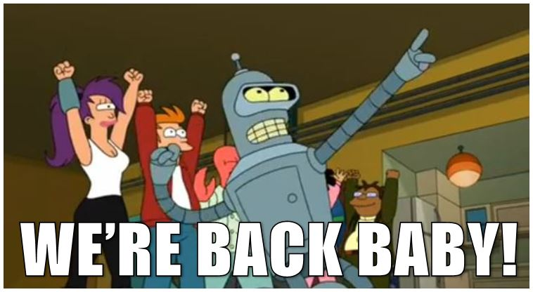

So I've truly neglected here, my original space on the internet.. It's been almost two years since my last post, which was really just a code snippet.

So moving forward I'm going to be blogging about completely different topics that I haven't blogged about before. .

For my current subscribers (it's hard to believe I still have subscribers) you may want to unsubscribe and decide if this is something you want to subscribe to moving forward.

So whats happened?

Well, a lot has happened since I've last posted on here. It's even kind of hard to timeline the last two years myself. I started my own web development company in Kilkenny (coder.ie), I did that for around a year and a half.. Learned a lot of valuable lessons throughout doing that. Got myself the funds needed to get to Canada (barely), now I'm living in Vancouver and working at [Motbot](http://www.motbot.com/) .

I love my new job, I don't think I would go back to owning my own company anytime soon. Landing a job after landing in Vancouver was a breath of relief and I really lucked out ending up with a company that are doing some amazing stuff. My co-workers are really experienced in their respective fields and I don't think a day goes by where I don't learn something new. It's so refreshing after the stress of working on my own for so long  and nearly losing my love for programming. I think that's partly why I stopped posting on here, when I finished working the last thing I wanted to do is use the computer any further.

I can't see myself returning to Ireland if I can work out staying here. Canada is an amazing country and Vancouver is just such a beautiful city.. So much is better here, its hard to even put into words, I'll try over a series of articles! 😛

### What are my future plans?

- **Create a game using Unity**
  - Anyone who knows me knows I've always wanted to create a game, that's what originally got me into programming. I've tipped my toes into a few games along my way, but I've never actually created my own game and had complete creative control. That's the next plan. I'm going to create a 2D game over the coming months and document my progress here along the way.
- **Learn C#**
  - Kind of ties into “Create a game using Unity” since C# will be the language I use most.. I never did get around to learning Python, hopefully that doesn't happen here, though its more unlikely since I'll actually have a use for it.
- **Improve as a poker player**
  - Yes we've gotten very into poker in the last year playing mainly online tournaments, I won't really get into this much here as there will be more content on it later.
- **Live Healthier**
  - I'm probably the picture of unhealthy living at the minute, I've been trying to make small changes to change this and hopefully all these small changes will turn into massive changes. Like quitting smoking, we've just been putting off doing that forever!!

So that's all I have for now, I hope this clarifies what way content will be headed in future!