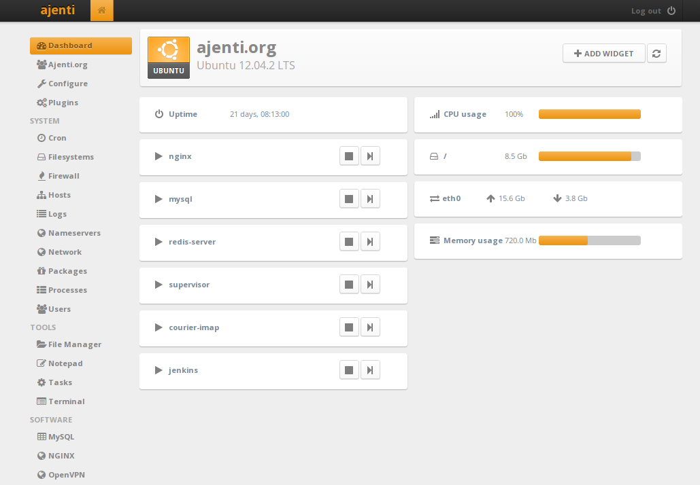

I’ve done a lot of installing of web servers over the last while, some of which have been effortless, others a thorn in my side. I’ve decided to compile a guide for my latest server setup that I’ve fallen in love with;

First a breakdown of what we’ll be installing today;

[Nginx](https://wiki.nginx.org/Main) : (pronounced Engine X) is a free, open-source, high-performance HTTP server and reverse proxy, as well as an IMAP/POP3 proxy server. Nginx doesn’t rely on threads to handle requests. Instead it uses a much more scalable event-driven (asynchronous) architecture. This architecture uses small, but more importantly,predictable amounts of memory under load.
Even if you don’t expect to handle thousands of simultaneous requests, you can still benefit from Nginx’s high-performance and small memory footprint. Nginx scales in all directions: from the smallest VPS all the way up to clusters of servers.

[Ajenti](https://ajenti.org/) : "The admin panel your servers deserve." Easily extensible using Python. Plugin development is fast and pleasant with rich APIs. Includes lots of plugins for system and software configuration, monitoring and management.

[Ajenti V](https://ajenti.org/) : A plugin for Ajenti that makes website setup easy – including app servers, database, and routing.

[Ubuntu](https://www.ubuntu.com/) : If you don’t know what Ubuntu is we’re in trouble.

Now I’m going to take a leap of faith and assume you can either install Ubuntu yourself or figure out how to get a server with it already. A [DigitalOcean droplet](https://www.digitalocean.com/?refcode=6ba177832a85) works perfectly here. So lets log in as root and run all this:

```bash
#Insall Ajenti
apt-get update
wget http://repo.ajenti.org/debian/key -O- | apt-key add -
echo "deb http://repo.ajenti.org/ng/debian main main ubuntu" >> /etc/apt/sources.list
apt-get update
apt-get install ajenti
service ajenti restart

# Uninstall Apache2
sudo apt-get autoremove && sudo apt-get remove apache2*

# Install Ajenti-v
apt-get install ajenti-v ajenti-v-nginx ajenti-v-mysql ajenti-v-php-fpm php5-mysql 

# If you <3 Ruby
apt-get install ajenti-v-ruby-unicorn ajenti-v-ruby-puma

# If you need Python
apt-get install ajenti-v-python-gunicorn

# If you need nodeJS
apt-get install ajenti-v-nodejs

# If you want FTP
apt-get install ajenti-v-ftp-pureftpd

# If you want mail
apt-get install ajenti-v-mail

# If you want POP support (for gmail etc.)
apt-get install courier-pop

# Restart All Services
sudo service php5-fpm restart
sudo service nginx restart
sudo service ajenti restart
```

You should now be able to log in to your Ajenti control panel at `https://yourserver.com:8000` with:

```text
username: root
password: admin
```

Now that’s done you’ll notice if you open `/etc/nginx/nginx.conf` that files inside `/etc/nginx/conf.d/` are loaded before any other .conf files, this is where you should put any additional configuration for Nginx. However if you are just configuring a specific domain or website you should just put the configuration in the Ajenti  website configuration’s advanced section.
