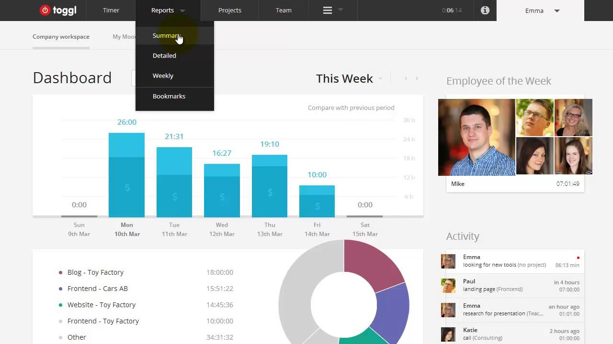
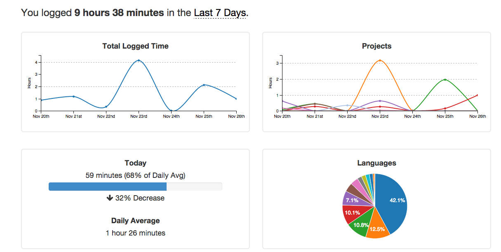

So lately I’ve been trying to manage my time better, with countless personal projects and legacy applications to support I find not properly tracking what I’m doing to surprisingly be more of a waste of time than tracking my time, even when you take in the time lost by tracking said time.

Firstly, I already use [Trello](https://trello.com/) for organizing my tasks across bigger projects,  I’m pretty sure most people do, it’s one of the best task management tools for things that are just general planning rather than bugs. For managing bugs I’m using [JIRA](https://www.atlassian.com/software/jira) or [Github Issues](http://www.github.com/) depending on if the project is open source or not. I’m generally trying to do as much open source as possible lately. For more general tasks I’m using [Todoist](http://todoist.com/) , which I recommend checking out if you haven’t, it has a very clean and simple interface.

So with all that in mind I set out to find an application that could potentially work with all of the above as well as give me time tracking. Handily enough I found [Toggl](http://www.toggl.com/) , which is completely free until you want to export invoices etc, which I don’t really have a need for right now.

[Toggl](http://www.toggl.com/) just takes all the hassle out of time tracking, after installing it’s browser plugin Toggl integrates with most task tools. [Github issues](http://github.com/) , [JIRA](https://www.atlassian.com/software/jira) , [Trello](https://trello.com/) , and [Todoist](http://todoist.com/) just to name a few.

So not only do they make it really easy, but how they actually output your data is really handy also.

Another one for any of you programmers is [WakaTime](https://wakatime.com/).

Wakatime allows you to install a plugin in your IDE of choice, pretty much all are supported, it basically reports on what programming languages your spending the most time using. Their graphs are not as pretty as Toggl’s but I still enjoy them!