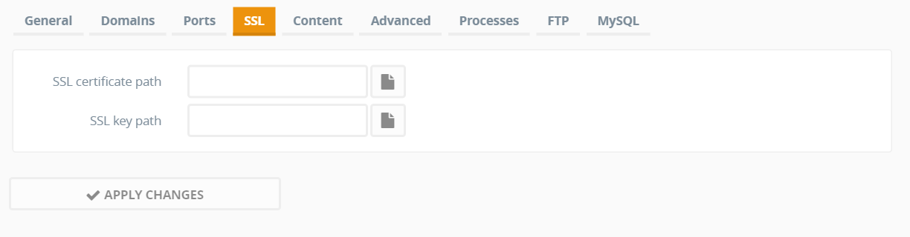
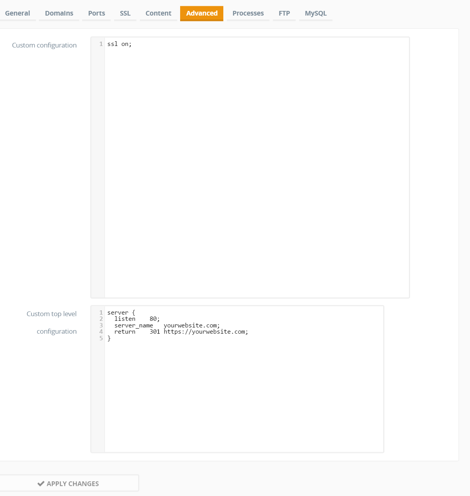
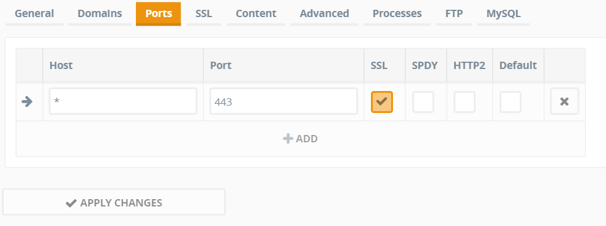

This is a quick post on how to use [LetsEncrypt](https://letsencrypt.org/) SSL certificates on your [Ajenti-v setup](/blog/2015/02/perfect-web-server) .

Ajenti-v will probably be supporting this natively at some point, there is an open issue on their Github [here](https://github.com/ajenti/ajenti/issues/797). But in the meantime you can just follow these steps to start using LetsEncrypt now.

You can click [this link](https://letsencrypt.org/getting-started/) and head to 'Getting Started' or you can just run these commands to install LetsEncrypt in the folder of your choice:

```bash
git clone https://github.com/letsencrypt/letsencrypt
cd letsencrypt
```
So now LetsEncrypt is installed, LetsEncrypt doesn't yet support nGinx and since that's what I'm using I'll assume that's what you're using, the automatic function won't work for us so we will have to use the 'certonly' option.

Run the following command and follow the steps.
```bash
service nginx stop
./letsencrypt-auto certonly
```

Now you should get a message like:
```text
Congratulations! Your certificate and chain have been saved at
   /etc/letsencrypt/live/yourdomain.com/fullchain.pem.
```
You can now restart nginx by running:
```bash
service nginx start
```
Now that we have the cert, it's time to see how we fit this into Ajenti. Open up the websites tab of Ajenti and open whatever website you've decided to do this for, hit the SSL tab and you will get this window:



So the first box gets filled in with what the wizard returned to us:

`/etc/letsencrypt/live/yourdomain.com/fullchain.pem`

The second box gets filled in with the certificates private key:

`/etc/letsencrypt/live/yourdomain.com/privkey.pem`

Now Ajenti knows what certificate to use, it is time to turn SSL on, lets get the Advanced configuration out of the way first:



The 'Custom top level configuration' you see will automatically redirect users accessing your website on http:// to the https:// domain.

Lastly we just need to change the website port from the default 80 to SSL's 443:



Apply changes, and check to make sure your website is still redirecting.