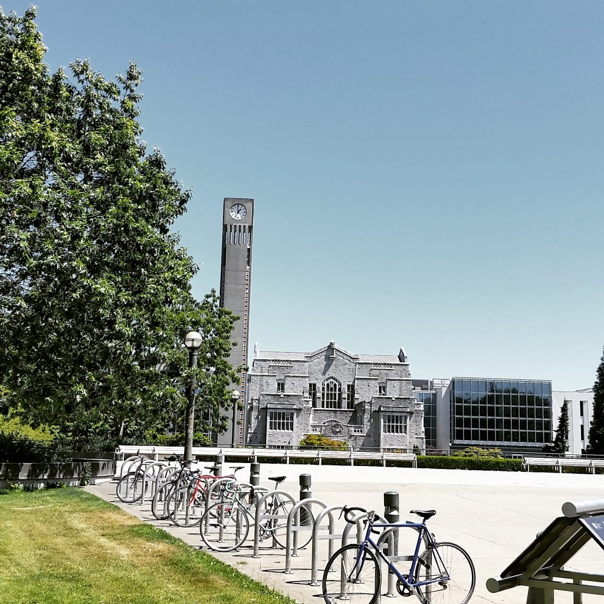
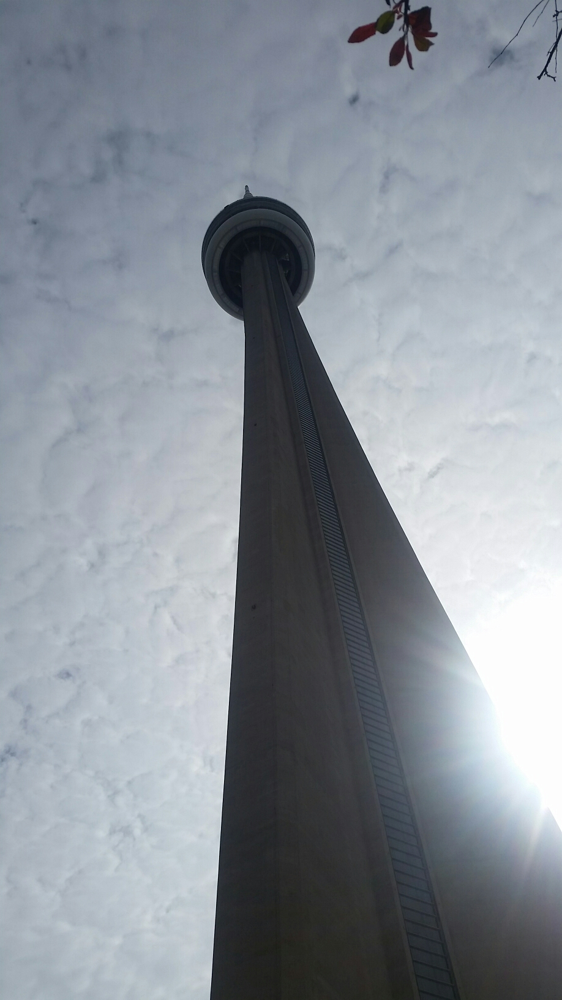

So I have left beautiful British Columbia and I’m back in Europe, in London of all places. I’ve gone full circle it seems!

I’m not going to bother going into the details of why I left Vancouver, but in short, you can’t extend a "two year working holiday" visa. Which totally sucks as after two years I had really set myself up over there.

So after many many goodbyes and cramming in as much touristy things as possible in the last couple of weeks I set sail back to London. Getting the cheapest possible flight which had two stopovers; Toronto (11 hours), Saint Johns (2 hours).

Eleven hours did not seem so bad to me when I was looking at the ticket however after my flight from Vancouver -> Toronto staying in the airport for anything over an hour did not seem appealing. So I got the train from the airport into the city. Unfortunately I hadn’t gotten any sleep during my flight at all so I was pretty exhausted and not so much in the mood to really explore Toronto. I spent about three hours just wandering about picking different places to sit down and rest, eventually giving up and going back to the airport to try sleep (no luck with that).

Saint Johns was uneventful, pretty much just had enough time to go and grab a cigarette outside and then re-do security before my flight. The flight from Saint Johns -> London seemed to take forever, again I got no sleep. I think I’m going to start drugging myself before long-haul flights in future, although I think that might make the stop-overs a bit more difficult 😛

But anyway, now I’m in London. Exchanging my money from CAD to GBP was very depressing, outside of that though re-exploring London has been a lot of fun!

I’ve got a double room in a flat for now, getting my own place initially just seemed like a terrible idea money wise. It’s nothing special, but it will do for now.

This week is going to be the CV and interview game, I have a couple of interviews lined up already and I’m going to apply to a bunch more jobs. I’m really not looking forward to going through the technical interview process all over again, it’s exhausting and very demoralizing at times. But it just unfortunately has to be done.

So if anyone reading this is in London and hiring do reach out to me, I can’t imagine it will take too long to find a job here however as there are many opportunities.

So that’s the personal update for now, there will likely be some more technical posts incoming in the near future.