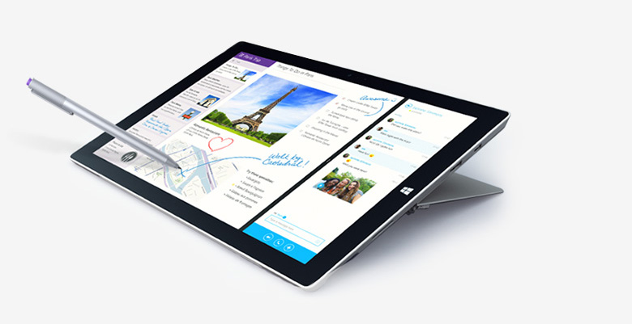

I bought a Surface Pro 3 in November 2014, I haven’t wrote anything at all about my thoughts on it since purchasing it, I figured it was better to wait until I had actually been using it for a significant amount of time and give it an honest review. A year and a half I figure to be more than enough time.

So this post is going to be structured in the following way, condensed Pro/Cons. for you speed readers and then just my personal thoughts on things I’ve come across while using the device.

**Pros**

- Amazingly portable, very light and much easier to use on your lap than a traditional laptop.
- Can run pretty much all software, Photoshop, Jetbrains products, Office etc all work well.
- Can run certain games, Hearthstone works great, older games like Warcraft aren’t an issue. Processor heavy games like Starcraft II will work but become extremely laggy when lots of units are out.
- Touchscreen is very satisfying to use for browsing the web etc.

**Cons**

- WiFi is a complete joke. Sometimes after resuming from sleep you won’t have WiFi anymore. I’ve had the WiFi just completely disappear on me and ended up having to wipe & restore the entire device.
- Overheating is a serious issue, even when running just a browser the surface can become incredibly hot, some people are combating this by having an external fan pointed at the device.
- The chargers connection to the Surface is pretty much the worst design ever. Unless you constantly make sure it’s not bending in any way whatsoever prepare to replace your charger every 6 months. The chargers are not cheap either!
- You constantly need to change the scaling of the resolution depending on what you’re running. Coding in an IDE scale up, games scale down. Changing scaling requires logging out and back into Windows, kind of awkward but could be worse.

Well that’s the basic pro and cons down, now lets get into why I actually bought the Surface and my personal feelings on it.

I bought the Surface because I needed a semi-powerful laptop that I could bring back and forth to work, having never owned a tablet the idea of the Surface appealed to me, being both a laptop and a tablet. I was not looking for a gaming laptop, but a laptop that could at least play some games. Mainly I needed a laptop that would allow me to do programming, wherever and whenever.

Success wise, portability worked out as expected. But I will say you really have to consider when buying the Surface for that reason how often are you going to be using it in that fashion.  When I actually use the device on a table, I always get the feeling that I would be better of using an actual laptop. I do however find the tablet aspects of it nice, just being able to disconnect the keyboard and have a powerful tablet for browsing the internet or playing touchscreen games is very nice.

Failure wise, I have no idea what the WiFi’s problem is half the time, it’s extremely frustrating to have to deal with it disappearing completely. I’ve tried a bunch of solutions on Google and there really isn’t any set answer to it, sometimes simple fixes will work, other times you have to wipe and restore the Surface completely. It’s without a doubt the biggest downfall of this device. The power cable is also a real nuisance to deal with as mentioned above. Another point is like every other device the battery gets worse over time and since there is no way of replacing the battery in the Surface your only solution is to buy another one.

So overall I would rate the Surface 30/42. I’m not entirely satisfied with it and I certainly will not be buying another one. I think it would be more suited to journalists or perhaps artists who would make more use of the pen.

If I could time travel and talk to myself before I bought it I would be telling myself to either buy a Lenovo or a MacBook instead.