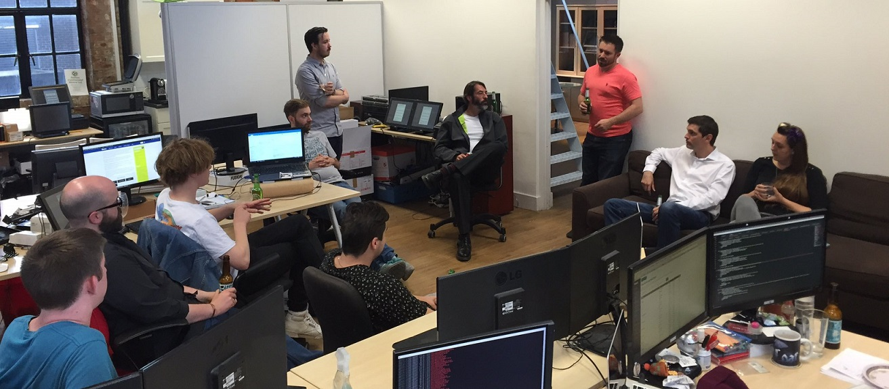
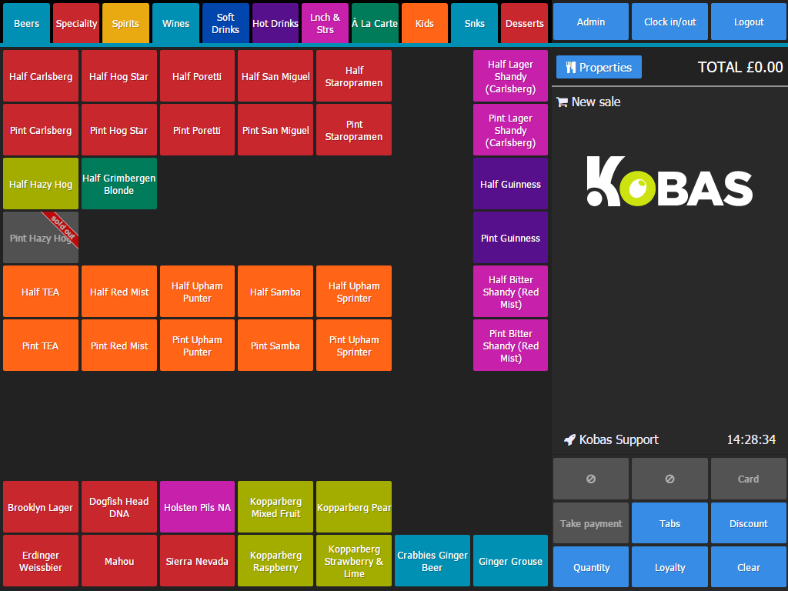
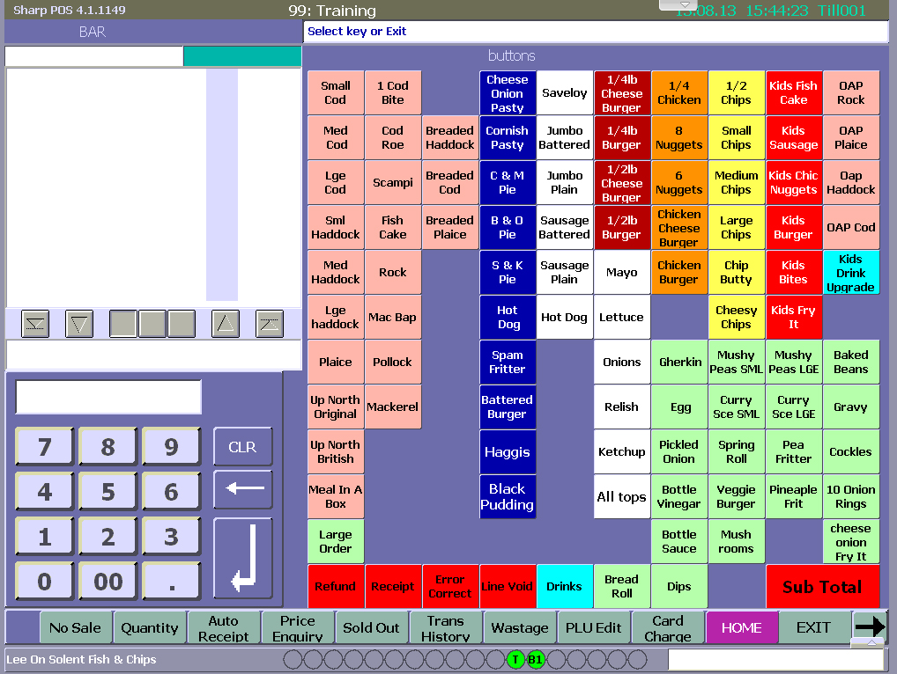

So I’ve been working for roughly a month at [Kobas](http://www.kobas.co.uk/) now, I think things have been going very well and I wanted to highlight what I’ve been working on for the last couple of weeks.

For anyone that does not know what [Kobas](http://www.kobas.co.uk/) does, it is a hospitality management solution covering; stock control, rotas, HR, EPoS, customer loyalty and much more. It’s actually a very useful piece of software for clients, allowing them to gather lots of data from all areas of their business and providing a cloud interface that outputs that data in fancy reports. After seeing it in action I find it very surprising that not all businesses use this as it can really help you to increase your profits and avoid wasting money unnecessarily.

Anyway, on to what I’ve been doing, I’ve been mainly working on the EPoS (Electronic Point of Sale) side of things, which in layman’s terms are the [Kobas](http://www.kobas.co.uk/) tills.

To side-track just a little I think the [Kobas](http://www.kobas.co.uk/) tills are so nice to look at and use, here is an example screen from one:

When you take that in comparison to a result from searching EPoS on Google Images (and what most places use):

Bit of a difference there right. So unfortunately now I have been burdened with the curse of noticing every single EPoS system every place I go and thinking to myself, "how do they use this?".

Anyway back to what I’m doing, basically I’ve been working on adding the functionality to accept deposits and other payment types to the EPoS. The EPoS accepted cash, card and voucher when I arrived, which was all you would really need basically.

But now with Christmas getting closer venues are going to be taking deposits for bookings and we wanted to be able to handle that within the EPoS itself.

Also with the rise of services like ‘Just Eat’ etc, venues are trying to figure out how to process payments from those services, as it’s not really a cash payment as you don’t have the money in your till and it’s not really a card payments as you haven’t put it through your card machine.

So with that in mind we also decided to create "Other payment types" which allow businesses to just tell us what other payments they want to accept and we are able to quickly add that functionality to the till and have it display in all relevant reports.

Our product manager Daisy Lang has wrote about it in much more detail [over here](http://www.kobas.co.uk/2016/06/deposits-bookings-custom-payments/).

Adding the ability to accept deposits and other payment types went well but I did encounter a few difficulties while doing it, for a starter constantly worrying about breaking the tax calculations (and having forgot how UK tax works).

Luckily I found a very edge case unit test wrote by Neil Mukerji (our CTO) and after converting it over to use the new version of the payment objects I was delighted to see it was still passing as expected.

Naturally I then decided to write a bunch more unit & functional tests, I’ve been on the [Codeception](http://codeception.com/) train lately, after getting introduced to it at the end of my role at UBC and I’m determined to get it set up properly in [Kobas](http://www.kobas.co.uk/) so that moving forward refactoring and changing code is much easier (and less stressful). I’m hoping to get all our tests into [Codeception](http://codeception.com/) shortly and add them into to the Jenkins build for automatic testing on deployment.

Also shockingly (due to not having it in my other roles) there is a whole QA team at [Kobas](http://www.kobas.co.uk/), which has been a total life-saver for me. Actually having someone QA features you’ve added is unbelievably helpful as when you’ve been working on something for so long it’s easy to miss things.

Anyway that’s all I have to talk about for now, I know what I’m doing in the coming months but I’m not going to mention that here, but stay tuned, interesting stuff is coming!