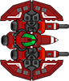
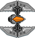
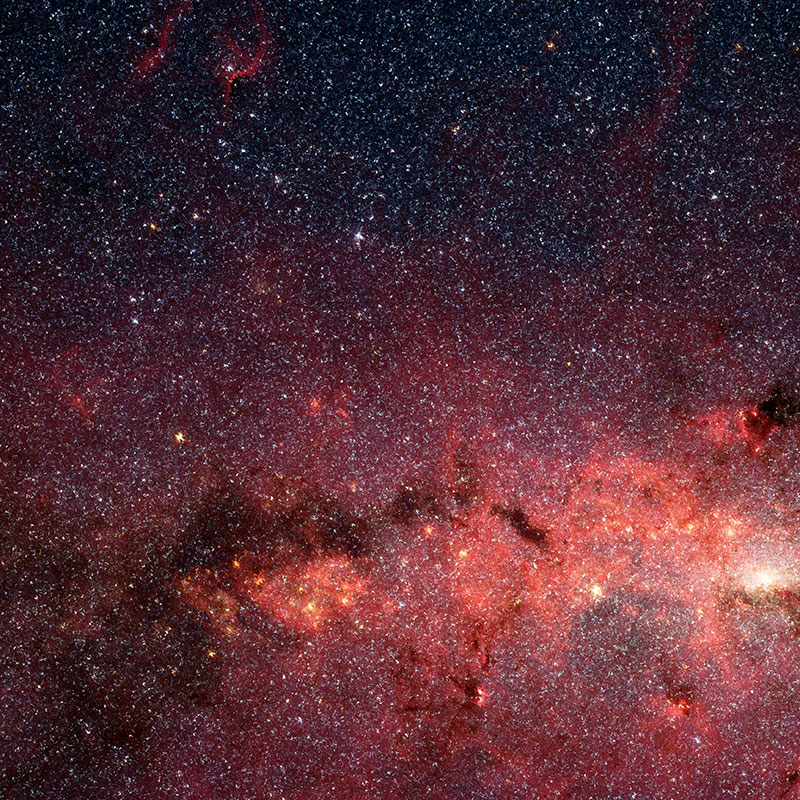

So week two of making an RTS was September 2nd – 9th. Almost three months later I’ve managed to spend most of my weekend on it. This is pretty typical timeline of any of my personal side-project’s. *sigh*

So I started on Friday after having a burger and beer at the ingeniously named [Burger and Beer](http://www.wearebeerandburger.com/) doing some work on graphics. Even though I haven’t put any work into the game I had been thinking about how to make things easier since I’ve decided to make an RTS game as my first game while learning PhaserJS. Not exactly the easiest idea to go for, snake or space invaders would have been much easier.
 
 So I decided to ditch my idea of having actual units that would require a lot of animation and switch to a space theme as spaceships seem easier overall to animate. I bought " [Space Shooter Creation Kit](http://www.gameart2d.com/space-shooter-creation-kit-3.html)" from [Gameart2d.com](http://www.gameart2d.com/) which was only $13.50 USD so pretty reasonable cost for a hobby project.

To begin with I really only need two sprites, one for a "fighter" and one for a "worker" so the following two seem to do the trick for now:

After that I decided to redo my tile map to match the space ships, I decided to just look for an image with a free to use license of space because how hard can that be, but space seems to be pretty low quality when zoomed in so I did end up having to do some editing of what I ended up finding. The result of that was this:

After implementing the new images in Phaser that was pretty much my Friday.

Saturday and Sunday (today) was spent trying to get units to move based on cursor movement, overall an hilarious experience. I spent a lot of  time laughing at the worker unit going out of control when I had bugs in movement and/or physics code.

Saturday I was attempting to actually get the functionality required, which is using the selection box to select units and then clicking a location to move those units to that location. However trying to do all of that at once was proving to be very confusing so I decided to first figure out how to get the sprite to move to the location clicked by the cursor. That worked easily enough as there are some in-built PhaserJS functions for that functionality, however since I don’t really intend on that being the functionality I ended up having to write some of my own functions so that when I have the selection group working the movement will work with it also. Doing that took most of Saturday and Sunday, my next challenge is getting the sprite to rotate to the moved location.

Lastly I realised I can host the whole thing on Github Pages since I have the code up in [my github repository](https://github.com/Seanmcn/Elemental-RTS) so throughout development [this url](https://seanmcn.github.io/Elemental-RTS/) will always be the master version of where I am at.

I’m hoping there won’t be as big of a gap between week 3 -> week 4, however next week is already looking pretty hectic so it is going to be delayed.