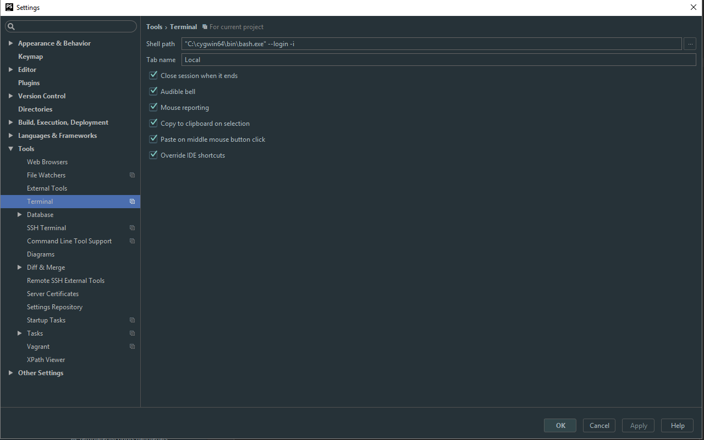
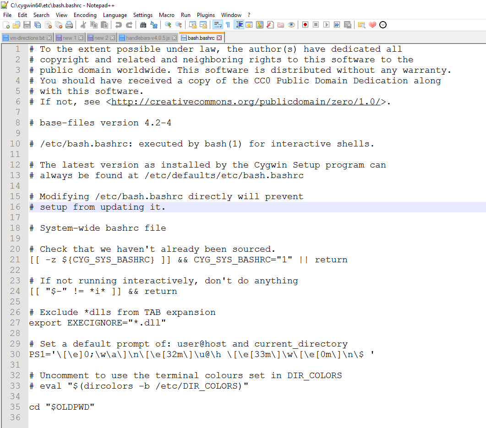

I’ve been meaning to post about this for a while, but it seems hard lately to make time to post here.

I personally hate windows shell, in my mind it is utterly useless. If I’m ever using it I’m probably not in a good mood. Powershell makes me laugh, like I’m sure it has some uses for people who for some insane reason run Windows servers, but for a sane developer; I think not.

Bash is where it’s at, probably the tool/language that saves me the most time on a day to day basis. Regex is a close second and guess what, Regex & Bash play very nicely together. Luckily I work with a company that exclusively uses Linux servers, because they make good decisions like that. So any server admin is painless, however for development, I still seem to be stuck in Windows land. I could make the leap over to just using Linux, however there are unfortunately a handful of programs keeping me on Windows and WINE still sucks.

So [Bash](https://www.gnu.org/software/bash/) on Windows, only one way to do that really. [Cygwin](https://www.cygwin.com/) . I’m not going to go into how to install that here, because it’s very simple, just download, run and press next.

[Jetbrains](https://www.jetbrains.com/) make amazing products, [PHPStorm](https://www.jetbrains.com/phpstorm/) is the editor I spend most of my time in, so I’ve shown how to do this here. However it should work for any [Jetbrains IDE](https://www.jetbrains.com/) since they are all pretty consistent.

I liked the idea of a terminal window inside the IDE, mainly as just a quick way to grep or find things within projects. So I decided to figure out how to replace the windows terminal embedded in it with the cygwin terminal.

So it turns out it’s pretty simple, just go File -> Settings and hit Tools -> Terminal. You’ll want to change it’s default from `cmd.exe` to `"C:\path_you_installed_cywin_to\bin\bash.exe" --login -i`

Here is an image of what I have:

After this, when you relaunch your terminal inside PHPStorm it will be the Cygwin terminal rather than the Windows terminal. However there is just one issue left to deal with, it will default to your Cygwin home directory rather than the project directory. Fixing this is also pretty easy just navigate to `C:\path_you_installed_cywin_to\etc\bash.bashrc` at the bottom of that file just add

`cd "$OLDPWD"`

Here is another image for those still confused:

Well that’s it, enjoy Bash’ing away inside PHPStorm.