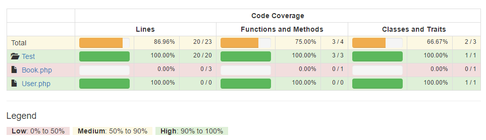

I’ve been at Kobas two years now, I previously wrote about [my experiences in my first month](/blog/2016/07/first-month-at-kobas) , so it seemed fitting to do an overview of my experiences since then surrounding the software we use for DevOps.

## Jenkins & Continuous Delivery

At Kobas we use continuous delivery rather than continuous deployment, tool of choice; old man [Jenkins](https://www.jenkins.io/) .

Jenkins, although riddled with UI/UX issues, is a very helpful tool for us day to day now. We have all sorts of pipelines setup for deploying to our EPoS & Cloud servers. Having the ‘one click’ ability to release to a QA or Production environment and letting Jenkins handle all the steps that go on throughout that build process is a time-saver.

Having the ability to rollback to a previous git tag when a bug has been introduced proves to be a real lifesaver. I can’t imagine going back to releasing projects via script or knowledge.

We keep our Jenkins configuration backed up in Git as the thought of losing all the work put into Jenkins and having to start again is nightmare inducing.

## Codeception & Jenkins
My latest win, and one that took the longest to achieve was having Codeception and Jenkins play nicely together for automated testing.

The initial part of that went fine, just getting Codeception to run automatically via the Jenkins build process. But then I decided I wanted metrics like code coverage, the ability to run acceptance tests via Selenium & being able to reset our testing database before each test runs.

Selenium is something I’ve played with a lot on my own machine, so setting up Selenium Grid on a server didn’t cause me much trouble.

Code coverage however has been a pain. Needing [c3.php](https://github.com/Codeception/c3) to get remote code coverage working required a number of disgusting hacks / workarounds. This was due to the way our project is setup, the main directory Codeception is in, isn’t even synced to our servers.

The results where worth the pain though I now have the ability of viewing a breakdown of code coverage like this:

(clearly not an image from our Jenkins, imagine a lot more red).

You also get a dashboard for coverage distribution and showing you the files with the most CRAP (change risk anti-patterns), my new favourite acronym. I can’t seem to find an example of that view online however.

Perhaps later I’ll do a blog post on how to set this up on an open source project and will link to it from here. (Making plans for 2020 already)

## Puppet & Server Config
 Controlling configuration manually might seem okay when you only have a handful of servers, I certainly manage my personal servers manually still.

At Kobas we have two types of servers, our ‘Cloud’ servers (hosted by AWS) and our ‘EPoS’ servers (hosted by our clients on-site). Currently, we have 4-5 AWS servers, and 170+ EPoS servers. Managing configuration change across the EPoS servers would be impossible without Puppet.

[Puppet](https://puppet.com/) isn’t the only tool that handles configuration management, there are a number of tools to choose between; [Chef](https://www.chef.io/chef/) and [Ansible](https://www.ansible.com/) are two that come to mind. I’ve only used Puppet so can’t comment on the advantages of one over the other. I do recommend getting at least one of these tools setup to manage your server configuration though as the pay-off is huge.

Using a configuration management tool ensures that all your configuration is the same across every environment; development, qa and production. Significantly reducing the ‘But it works on my machine’ issue. It also requires you to put additional thought into making configuration changes.