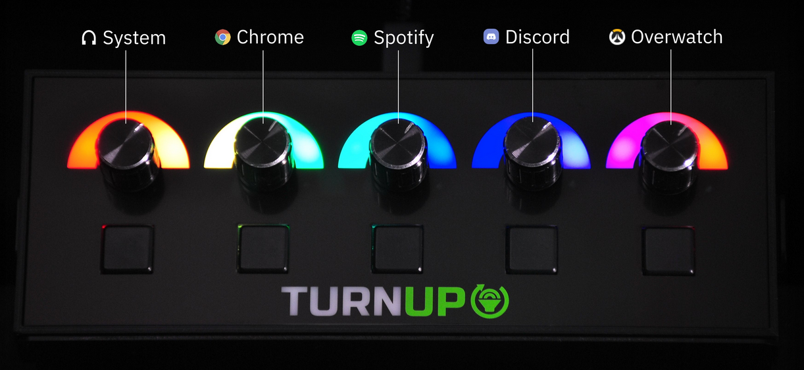

Last week my brother Kieran told me to expect a delivery, I love surprise gifts :laughing:, after opening the package I realised it was a volume mixer by [TurnUp software](https://www.turnup.tech/), a Kickstarter project.

A volume mixer isn't something I would have ever thought of purchasing, I didn't see the appeal when the Windows Sound Mixer exists. However, it turns out that a physical volume mixer is one of those devices that when you get used to using it, it's hard to imagine going back to not having one.

Normally when I'm relaxing, I'll be playing video games, I'll have Discord, Spotify and "insert video game of month" open. I'll then use Windows Sound Mixer to adjust the levels as the music changes/I move to a different game. It's workable, but a bit annoying, especially with games where you are heavily reliant on sounds (eg; Dead by Daylight). I also have some keyboard shortcuts bound to mute and deafen myself on Discord while in-game.

I've now moved and centralised all the above functionality with the volume mixer. It's so much easier to quickly adjust the volume on a program now.

*My volume mixer setup (left to right):*

- *Volume knobs:* system, Spotify, Discord, active window, Microphone
- *Buttons:* mute system, pause Spotify, deafen Discord, mute active window, mute microphone.

The device itself feels well-made and sturdy, the volume knobs are pretty much what you'd expect on an amplifier. The USB-C cable that came with mine was faulty, it was causing Windows to stop recognising the device randomly, but once I replaced the cable, I've had no further issues.

The software for the device is _okay_, but I hope it will improve with time. It is functional currently, but it could do with further work, especially on the UI/UX side. Accidentally hitting the "Apply to All" button (which is in a very odd place) during configuration makes for a frustrating experience.

Overall, for $69-$79, this device is great value for money, I'd recommend it to anyone interested in getting a volume mixer.
